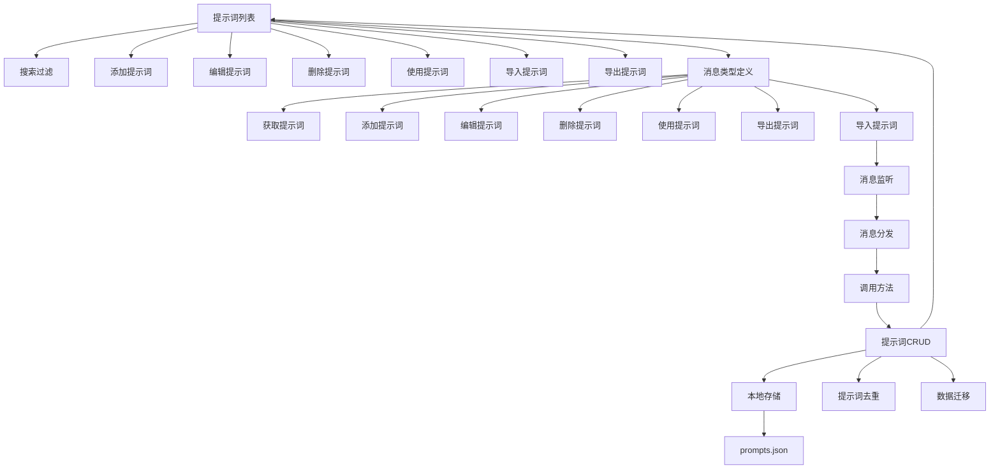

# 提示词管理模块文档

## 核心文件结构

1. `src/prompts/PromptsManager.ts` - 提示词管理的核心类
   - 负责提示词的 CRUD 操作
   - 处理提示词的导入导出
   - 管理本地存储和数据迁移

2. `webview-ui/src/components/prompts/PromptsView.tsx` - 提示词管理界面
   - 提供用户交互界面
   - 处理提示词的展示和操作
   - 实现搜索过滤功能

3. `src/shared/WebviewMessage.ts` - 消息类型定义
   - 定义前后端通信消息类型
   - 包含提示词相关的所有操作类型

4. `src/core/webview/ClineProvider.ts` - 消息处理
   - 处理前端发送的消息
   - 调用相应的 PromptsManager 方法
   - 返回操作结果给前端

## 架构流程图



## 功能流程说明

### 1. 提示词基础管理

- **显示功能**
  - PromptsView 组件渲染提示词列表
  - 支持分页和动态加载
  - 展示提示词的完整信息

- **搜索功能**
  - 支持按名称搜索
  - 支持按描述搜索
  - 支持按分类搜索
  - 支持按标签搜索
  - 支持按内容搜索

- **编辑功能**
  - 添加新提示词
  - 修改现有提示词
  - 删除指定提示词

### 2. 提示词导入导出

- **导出功能**
  - 导出格式：JSON
  - 包含所有提示词信息
  - 保留分类和标签信息

- **导入功能**
  - 支持 JSON 格式导入
  - 自动去重处理
  - 保持原有属性
  - 生成新的唯一标识

### 3. 数据流转过程

```
用户操作 
-> PromptsView发送消息 
-> WebviewMessage定义消息类型 
-> ClineProvider处理消息 
-> PromptsManager执行操作 
-> 更新本地存储 
-> 通知UI更新
```

### 4. 数据持久化

- **存储位置**：用户数据目录下的 `prompts.json`
- **数据格式**：
  ```json
  {
    "version": "1.0.0",
    "prompts": [
      {
        "id": "唯一标识",
        "name": "提示词名称",
        "description": "提示词描述",
        "content": "提示词内容",
        "category": "分类",
        "tags": ["标签1", "标签2"],
        "createdAt": "创建时间",
        "updatedAt": "更新时间"
      }
    ]
  }
  ```
- **数据迁移**：支持从旧版本配置文件自动迁移

### 5. 错误处理

- 文件操作异常处理
- 导入导出异常处理
- 用户友好的错误提示
- 操作结果反馈

## 设计原则

1. **关注点分离**
   - UI 层专注于展示和交互
   - 通信层处理消息传递
   - 数据层管理状态和存储

2. **单向数据流**
   - 数据变更统一由 PromptsManager 处理
   - UI 通过消息机制触发更新
   - 状态变化通知所有相关组件

3. **可扩展性**
   - 模块化的设计
   - 清晰的接口定义
   - 易于添加新功能

4. **用户体验**
   - 响应式设计
   - 清晰的操作反馈
   - 友好的错误提示 